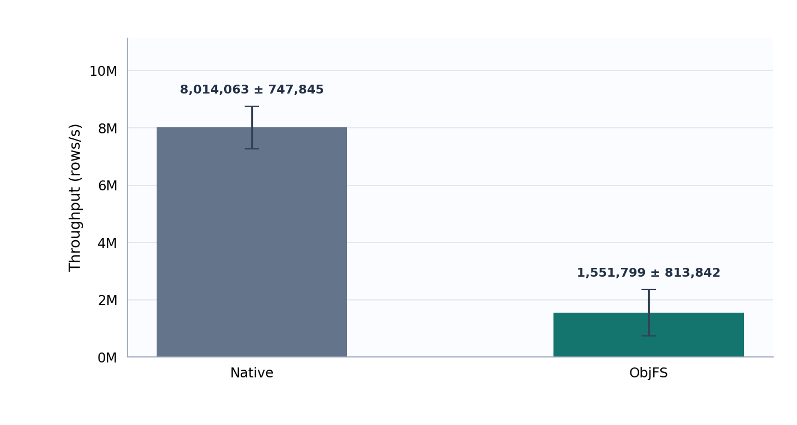
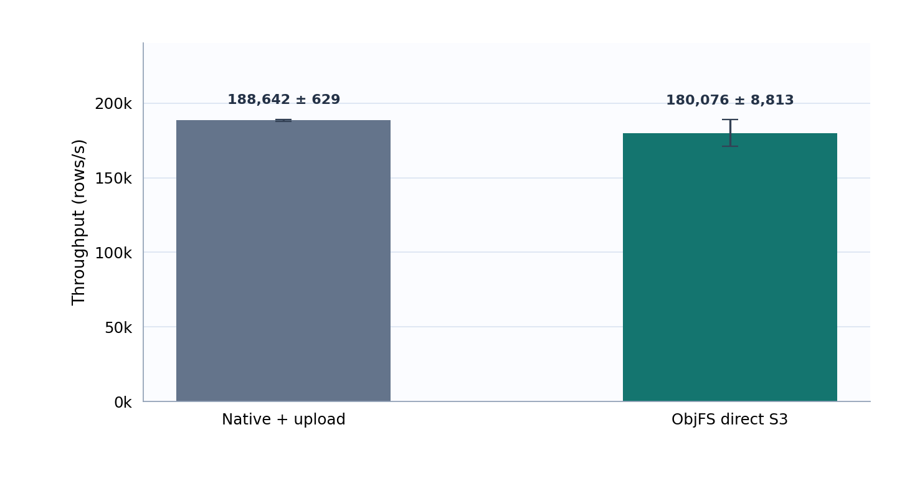

# Benchmarks

`scripts/run_read_benchmarks.py` compares native DuckDB with ObjFS using TPC-H reads.
It currently supports macOS only (`system_profiler` is used for host metadata)
and builds the release binary automatically. Run commands from the repository
root.

## Read results

Results with DuckDB `v1.5.5` on an Apple M4 (10 cores, 16 GB memory,
default 10 threads). Local SF10 used commit `21bae82`; remote SF1 ObjFS used
commit `72a21ed`. Values below 1.00× favor ObjFS.

### Local: memory

These SF10 results used one warm-up and five measured executions per query;
use `--runs 5` to repeat that count. Bars show medians, whiskers show
one sample standard deviation, and labels show the ObjFS/native median ratio.


| Query | Native median ± SD | ObjFS median ± SD | ObjFS/native |
| --- | ---: | ---: | ---: |
| Q01 | 213.3 ± 33.9 ms | 186.7 ± 4.0 ms | 0.88× |
| Q02 | 34.7 ± 3.2 ms | 23.8 ± 1.2 ms | 0.69× |
| Q03 | 78.9 ± 2.6 ms | 77.4 ± 3.1 ms | 0.98× |
| Q04 | 78.8 ± 5.3 ms | 77.3 ± 1.1 ms | 0.98× |
| Q05 | 78.5 ± 3.2 ms | 75.7 ± 2.5 ms | 0.96× |
| Q06 | 30.9 ± 0.4 ms | 31.5 ± 0.3 ms | 1.02× |
| Q07 | 70.1 ± 1.6 ms | 69.3 ± 0.5 ms | 0.99× |
| Q08 | 76.4 ± 2.3 ms | 73.7 ± 1.2 ms | 0.97× |
| Q09 | 346.4 ± 63.8 ms | 274.9 ± 23.6 ms | 0.79× |
| Q10 | 187.4 ± 16.5 ms | 160.0 ± 3.0 ms | 0.85× |
| Q11 | 13.3 ± 0.8 ms | 12.3 ± 0.4 ms | 0.92× |
| Q12 | 81.2 ± 2.0 ms | 77.8 ± 1.8 ms | 0.96× |
| Q13 | 380.6 ± 7.6 ms | 339.3 ± 51.7 ms | 0.89× |
| Q14 | 69.0 ± 11.5 ms | 59.1 ± 0.6 ms | 0.86× |
| Q15 | 51.4 ± 5.0 ms | 47.7 ± 1.9 ms | 0.93× |
| Q16 | 61.0 ± 17.0 ms | 50.3 ± 1.0 ms | 0.83× |
| Q17 | 83.4 ± 2.6 ms | 77.8 ± 1.6 ms | 0.93× |
| Q18 | 254.3 ± 9.6 ms | 231.3 ± 4.1 ms | 0.91× |
| Q19 | 126.0 ± 2.3 ms | 143.9 ± 9.8 ms | 1.14× |
| Q20 | 74.9 ± 5.0 ms | 72.4 ± 3.7 ms | 0.97× |
| Q21 | 287.5 ± 8.7 ms | 272.9 ± 3.1 ms | 0.95× |
| Q22 | 57.1 ± 4.0 ms | 52.7 ± 1.1 ms | 0.92× |

### Local: filesystem

These SF10 results used one warm-up and five measured executions per query;
use `--runs 5` to repeat that count.


| Query | Native median ± SD | ObjFS median ± SD | ObjFS/native |
| --- | ---: | ---: | ---: |
| Q01 | 186.7 ± 17.2 ms | 230.3 ± 10.7 ms | 1.23× |
| Q02 | 24.2 ± 0.2 ms | 30.5 ± 2.3 ms | 1.26× |
| Q03 | 74.0 ± 3.8 ms | 79.4 ± 2.6 ms | 1.07× |
| Q04 | 74.1 ± 1.7 ms | 86.8 ± 29.6 ms | 1.17× |
| Q05 | 73.0 ± 0.9 ms | 102.1 ± 11.2 ms | 1.40× |
| Q06 | 30.5 ± 0.1 ms | 42.0 ± 2.2 ms | 1.38× |
| Q07 | 66.5 ± 0.3 ms | 75.6 ± 4.8 ms | 1.14× |
| Q08 | 70.2 ± 0.3 ms | 74.0 ± 1.8 ms | 1.05× |
| Q09 | 262.1 ± 7.3 ms | 280.0 ± 15.7 ms | 1.07× |
| Q10 | 156.3 ± 2.8 ms | 165.2 ± 15.5 ms | 1.06× |
| Q11 | 11.6 ± 0.1 ms | 12.0 ± 0.2 ms | 1.04× |
| Q12 | 74.9 ± 0.3 ms | 89.9 ± 8.6 ms | 1.20× |
| Q13 | 313.3 ± 5.6 ms | 325.2 ± 11.0 ms | 1.04× |
| Q14 | 59.8 ± 0.9 ms | 60.5 ± 1.3 ms | 1.01× |
| Q15 | 47.1 ± 0.7 ms | 48.3 ± 0.5 ms | 1.02× |
| Q16 | 54.9 ± 2.2 ms | 51.0 ± 0.9 ms | 0.93× |
| Q17 | 81.1 ± 3.4 ms | 80.0 ± 1.6 ms | 0.99× |
| Q18 | 237.8 ± 8.8 ms | 234.9 ± 6.4 ms | 0.99× |
| Q19 | 130.4 ± 4.7 ms | 129.6 ± 4.8 ms | 0.99× |
| Q20 | 69.5 ± 1.6 ms | 68.8 ± 0.7 ms | 0.99× |
| Q21 | 286.5 ± 8.0 ms | 273.3 ± 2.4 ms | 0.95× |
| Q22 | 54.7 ± 2.6 ms | 51.7 ± 0.4 ms | 0.95× |

### Remote S3

TPC-H SF1, three cold-process runs per query. Native reads through HTTPFS;
ObjFS uses memory cache with persistent cache disabled. Only query time is
measured. Bars show medians ± sample standard deviation; labels show the
ObjFS/native ratio. The two variants were measured sequentially.


| Query | Native median ± SD | ObjFS median ± SD | ObjFS/native |
| --- | ---: | ---: | ---: |
| Q01 | 3.569 ± 0.124 s | 3.825 ± 0.017 s | 1.07× |
| Q02 | 655.8 ± 173.4 ms | 600.7 ± 152.7 ms | 0.92× |
| Q03 | 3.321 ± 0.211 s | 4.215 ± 0.067 s | 1.27× |
| Q04 | 2.525 ± 0.140 s | 3.254 ± 0.091 s | 1.29× |
| Q05 | 3.557 ± 0.152 s | 4.352 ± 0.151 s | 1.22× |
| Q06 | 2.543 ± 0.177 s | 3.109 ± 0.049 s | 1.22× |
| Q07 | 3.781 ± 0.097 s | 4.618 ± 0.284 s | 1.22× |
| Q08 | 4.237 ± 0.228 s | 5.406 ± 0.166 s | 1.28× |
| Q09 | 4.937 ± 0.201 s | 5.793 ± 0.280 s | 1.17× |
| Q10 | 5.194 ± 0.227 s | 5.654 ± 0.316 s | 1.09× |
| Q11 | 509.0 ± 122.7 ms | 610.2 ± 48.0 ms | 1.20× |
| Q12 | 3.092 ± 0.077 s | 4.251 ± 0.083 s | 1.37× |
| Q13 | 2.045 ± 0.216 s | 2.067 ± 0.040 s | 1.01× |
| Q14 | 3.108 ± 0.099 s | 3.808 ± 0.163 s | 1.22× |
| Q15 | 2.803 ± 0.134 s | 3.399 ± 0.101 s | 1.21× |
| Q16 | 372.1 ± 58.7 ms | 588.3 ± 83.4 ms | 1.58× |
| Q17 | 2.924 ± 0.098 s | 3.706 ± 0.133 s | 1.27× |
| Q18 | 2.422 ± 0.088 s | 3.131 ± 0.104 s | 1.29× |
| Q19 | 4.654 ± 0.121 s | 5.458 ± 0.299 s | 1.17× |
| Q20 | 3.800 ± 0.055 s | 4.497 ± 0.178 s | 1.18× |
| Q21 | 2.915 ± 0.129 s | 3.943 ± 0.079 s | 1.35× |
| Q22 | 807.9 ± 62.0 ms | 824.2 ± 93.0 ms | 1.02× |

Local SF10 and remote SF1 are separate runs and should not be compared directly.

## Write results

### Write: local filesystem

TPC-H SF10 `lineitem`, three fresh databases per backend. Throughput covers
`CREATE TABLE AS SELECT` and `CHECKPOINT`; higher is better. Bars show medians
and whiskers show one sample standard deviation.



| Backend | Median ± SD (rows/s) |
| --- | ---: |
| Native | 8,014,063 ± 747,845 |
| ObjFS | 1,551,799 ± 813,842 |

ObjFS/native median throughput: 0.19×.

### Write: S3 delivery

TPC-H SF1 `lineitem`, three fresh databases per backend. Native writes and
checkpoints locally, then uploads its `.duckdb` file; ObjFS writes and
checkpoints directly to S3. Throughput covers these respective delivery paths.



| Backend | Median ± SD (rows/s) |
| --- | ---: |
| Native + upload | 188,642 ± 629 |
| ObjFS direct S3 | 180,076 ± 8,813 |

ObjFS/native median throughput: 0.95×. Both write comparisons use the same
in-memory source within each run; source generation and verification are untimed.

## Quick check

Run SF0.01 Q6 once to verify the build and report generation:

```sh
python3 scripts/run_read_benchmarks.py --smoke
```

Use `--runs N` to set measured executions per query (default: 3; smoke: 1).

## Local benchmark

Compare native and ObjFS memory and local-filesystem backends with SF10,
TPC-H Q1-Q22, one warm-up, and three measured runs:

```sh
python3 scripts/run_read_benchmarks.py --scale-factor 10
```

## S3 benchmark

The bucket must already exist, and the AWS profile must have read/write access:

```sh
aws sts get-caller-identity --profile <profile>
aws s3api list-objects-v2 --bucket <bucket> --prefix benchmarks/ \
  --max-keys 1 --region ap-east-2 --profile <profile>
```

The runner creates a unique `benchmarks/<run-id>/` prefix. Native DuckDB runs
`dbgen` and `CHECKPOINT` locally, then uploads one `.duckdb` file. ObjFS runs
`dbgen` and `CHECKPOINT` directly against S3, producing multiple objects.
Each query uses a fresh process and runs three times without a warm-up.

| Reported S3 setting | Value |
| --- | --- |
| Client | Taipei; Apple M4, 10 cores, 16 GB RAM |
| Storage | Same S3 bucket in `ap-east-2` |
| DuckDB | `v1.5.5`; default 10 threads and memory limit |
| ObjFS in-memory cache | Data blocks: 512 MiB; metadata: 128 MiB |
| ObjFS persistent cache | Disabled |
| Native HTTPFS cache | External file cache enabled; empty in each fresh process |

```sh
caffeinate -dimsu python3 scripts/run_read_benchmarks.py \
  --remote \
  --scale-factor 1 \
  --s3-bucket <bucket> \
  --s3-region ap-east-2 \
  --aws-profile <profile>
```

Add `--smoke` and omit `--scale-factor` to run SF0.01 Q6 once before the full
benchmark.

Use `--reuse-s3-prefix <prefix>` to query an existing generated dataset
without uploading or generating it again.

Add `--persistent-cache` to enable both memory and persistent ObjFS caches.
Every measured query receives a new empty persistent-cache directory, which is
removed after its statistics are collected; cache contents are never shared.

## Outputs

Each run writes raw data, logs, profiles, `results.json`, and `summary.csv` to:

```text
.cache/object-storage-benchmark/<run>/
```

The generated HTML report is written to `docs/BENCHMARK_READ_REPORT.html` for local
runs or `docs/BENCHMARK_READ_REMOTE_REPORT.html` for S3 runs. These generated reports
are ignored by Git. Rebuild a report from existing data without rerunning the
benchmark:

```sh
python3 scripts/run_read_benchmarks.py \
  --render-results .cache/object-storage-benchmark/<run>/results.json
```

## Write benchmark

`scripts/run_write_benchmarks.py` uses DuckDB v1.5.5 to generate TPC-H data
`lineitem` in memory before timing. Each measured run writes that table to a
fresh database with `CREATE TABLE ... AS SELECT ...` and `CHECKPOINT`.
The source generation, database attachment, startup, and verification are
excluded. The benchmark reports rows/s; SQL profiler timings separately show
the table write and checkpoint. Every result is checked after reopening.
Local database files are deleted after verification; results and logs remain.
Each run executes Native first, then ObjFS.

Run the SF0.01 local smoke test, then the three-run SF1 local comparison:

```sh
python3 scripts/run_write_benchmarks.py --local --smoke
python3 scripts/run_write_benchmarks.py --local
```

Use `--scale-factor 10` for SF10. As with the read benchmark, `--runs N`
sets the repetition count (default: 3; smoke: 1); `--smoke` uses SF0.01 and
cannot be combined with `--scale-factor`.

For S3, first check that the AWS profile can access the bucket, then run
the separate `--remote` comparison (also accepts `--smoke`):

```sh
aws sts get-caller-identity --profile <profile>
aws s3api head-bucket --bucket <bucket> --region ap-east-2 --profile <profile>
python3 scripts/run_write_benchmarks.py --remote \
  --s3-bucket <bucket> --s3-region ap-east-2 --aws-profile <profile>
```

The S3 comparison measures native DuckDB writing a local `.duckdb` file and
then uploading it with the AWS CLI, versus ObjFS writing directly to S3.
Upload time is shown separately; HTTPFS only reopens the native S3 database
for read-only verification. These are delivery workflows, not identical
storage formats. Each run uses a new S3 prefix; the script does not remove
uploaded benchmark data.

Raw results and logs go to `.cache/object-storage-benchmark/<run>/`; the
HTML reports are `docs/BENCHMARK_WRITE_REPORT.html` for local and
`docs/BENCHMARK_WRITE_REMOTE_REPORT.html` for S3. ObjFS cache and OpenDAL I/O
statistics are saved per run in `results.json` and summarized in each report.
Use `--no-build` to use an existing release binary.
Regenerate the report without rerunning the benchmark with
`--render-results .cache/object-storage-benchmark/<run>/results.json`.
