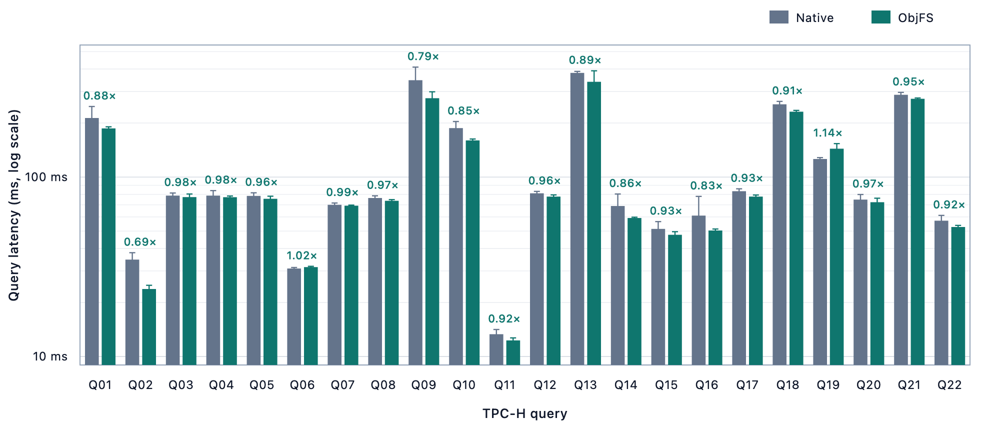
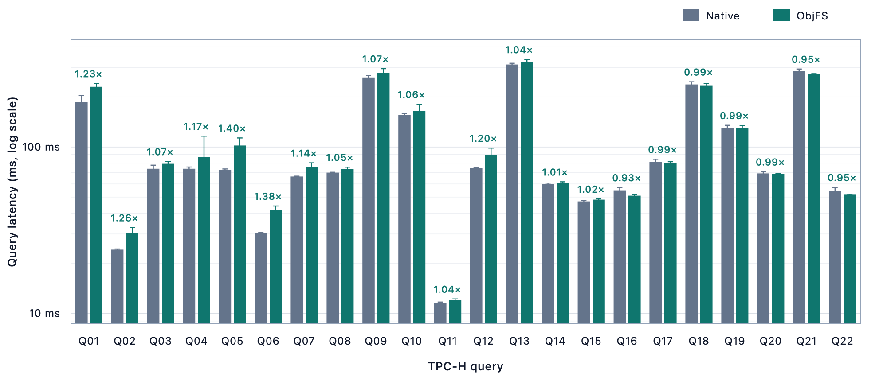
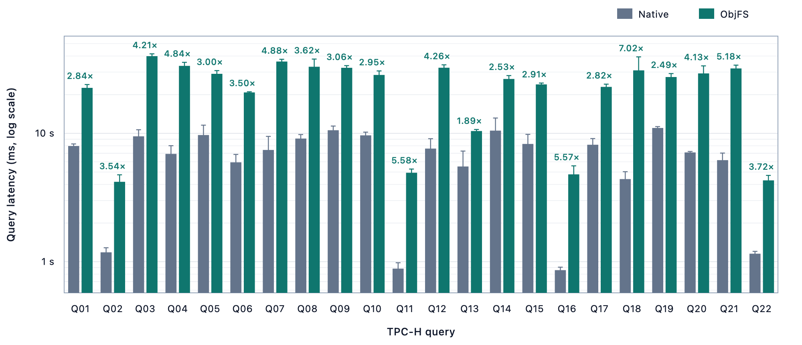

# Benchmarks

`scripts/run_benchmarks.py` compares native DuckDB with ObjFS using TPC-H.
It builds the release binary automatically. Run commands from the repository
root.

## Initial results

Preliminary results from commit `21bae82` with DuckDB `v1.5.5` on an Apple M4
(10 cores, 16 GB memory, default 10 threads). Values below 1.00× favor ObjFS.

### Local: memory

TPC-H SF10 with one warm-up and five measured executions per query. Bars show
medians, whiskers show one sample standard deviation, and labels show the
ObjFS/native median ratio.



| Query | Native median ± SD | ObjFS median ± SD | ObjFS/native |
| --- | ---: | ---: | ---: |
| Q01 | 213.3 ± 33.9 ms | 186.7 ± 4.0 ms | 0.88× |
| Q02 | 34.7 ± 3.2 ms | 23.8 ± 1.2 ms | 0.69× |
| Q03 | 78.9 ± 2.6 ms | 77.4 ± 3.1 ms | 0.98× |
| Q04 | 78.8 ± 5.3 ms | 77.3 ± 1.1 ms | 0.98× |
| Q05 | 78.5 ± 3.2 ms | 75.7 ± 2.5 ms | 0.96× |
| Q06 | 30.9 ± 0.4 ms | 31.5 ± 0.3 ms | 1.02× |
| Q07 | 70.1 ± 1.6 ms | 69.3 ± 0.5 ms | 0.99× |
| Q08 | 76.4 ± 2.3 ms | 73.7 ± 1.2 ms | 0.97× |
| Q09 | 346.4 ± 63.8 ms | 274.9 ± 23.6 ms | 0.79× |
| Q10 | 187.4 ± 16.5 ms | 160.0 ± 3.0 ms | 0.85× |
| Q11 | 13.3 ± 0.8 ms | 12.3 ± 0.4 ms | 0.92× |
| Q12 | 81.2 ± 2.0 ms | 77.8 ± 1.8 ms | 0.96× |
| Q13 | 380.6 ± 7.6 ms | 339.3 ± 51.7 ms | 0.89× |
| Q14 | 69.0 ± 11.5 ms | 59.1 ± 0.6 ms | 0.86× |
| Q15 | 51.4 ± 5.0 ms | 47.7 ± 1.9 ms | 0.93× |
| Q16 | 61.0 ± 17.0 ms | 50.3 ± 1.0 ms | 0.83× |
| Q17 | 83.4 ± 2.6 ms | 77.8 ± 1.6 ms | 0.93× |
| Q18 | 254.3 ± 9.6 ms | 231.3 ± 4.1 ms | 0.91× |
| Q19 | 126.0 ± 2.3 ms | 143.9 ± 9.8 ms | 1.14× |
| Q20 | 74.9 ± 5.0 ms | 72.4 ± 3.7 ms | 0.97× |
| Q21 | 287.5 ± 8.7 ms | 272.9 ± 3.1 ms | 0.95× |
| Q22 | 57.1 ± 4.0 ms | 52.7 ± 1.1 ms | 0.92× |

### Local: filesystem

TPC-H SF10 with one warm-up and five measured executions per query.



| Query | Native median ± SD | ObjFS median ± SD | ObjFS/native |
| --- | ---: | ---: | ---: |
| Q01 | 186.7 ± 17.2 ms | 230.3 ± 10.7 ms | 1.23× |
| Q02 | 24.2 ± 0.2 ms | 30.5 ± 2.3 ms | 1.26× |
| Q03 | 74.0 ± 3.8 ms | 79.4 ± 2.6 ms | 1.07× |
| Q04 | 74.1 ± 1.7 ms | 86.8 ± 29.6 ms | 1.17× |
| Q05 | 73.0 ± 0.9 ms | 102.1 ± 11.2 ms | 1.40× |
| Q06 | 30.5 ± 0.1 ms | 42.0 ± 2.2 ms | 1.38× |
| Q07 | 66.5 ± 0.3 ms | 75.6 ± 4.8 ms | 1.14× |
| Q08 | 70.2 ± 0.3 ms | 74.0 ± 1.8 ms | 1.05× |
| Q09 | 262.1 ± 7.3 ms | 280.0 ± 15.7 ms | 1.07× |
| Q10 | 156.3 ± 2.8 ms | 165.2 ± 15.5 ms | 1.06× |
| Q11 | 11.6 ± 0.1 ms | 12.0 ± 0.2 ms | 1.04× |
| Q12 | 74.9 ± 0.3 ms | 89.9 ± 8.6 ms | 1.20× |
| Q13 | 313.3 ± 5.6 ms | 325.2 ± 11.0 ms | 1.04× |
| Q14 | 59.8 ± 0.9 ms | 60.5 ± 1.3 ms | 1.01× |
| Q15 | 47.1 ± 0.7 ms | 48.3 ± 0.5 ms | 1.02× |
| Q16 | 54.9 ± 2.2 ms | 51.0 ± 0.9 ms | 0.93× |
| Q17 | 81.1 ± 3.4 ms | 80.0 ± 1.6 ms | 0.99× |
| Q18 | 237.8 ± 8.8 ms | 234.9 ± 6.4 ms | 0.99× |
| Q19 | 130.4 ± 4.7 ms | 129.6 ± 4.8 ms | 0.99× |
| Q20 | 69.5 ± 1.6 ms | 68.8 ± 0.7 ms | 0.99× |
| Q21 | 286.5 ± 8.0 ms | 273.3 ± 2.4 ms | 0.95× |
| Q22 | 54.7 ± 2.6 ms | 51.7 ± 0.4 ms | 0.95× |

### Remote S3

TPC-H SF1 with three cold executions in independent processes. Native DuckDB
uses HTTPFS; ObjFS uses memory caches and a new empty persistent-cache directory
for every process.



| Query | Native median ± SD | ObjFS median ± SD | ObjFS/native |
| --- | ---: | ---: | ---: |
| Q01 | 7.962 ± 0.308 s | 22.590 ± 1.393 s | 2.84× |
| Q02 | 1.183 ± 0.102 s | 4.194 ± 0.554 s | 3.54× |
| Q03 | 9.483 ± 1.184 s | 39.910 ± 1.703 s | 4.21× |
| Q04 | 6.918 ± 1.088 s | 33.517 ± 2.184 s | 4.84× |
| Q05 | 9.698 ± 1.887 s | 29.081 ± 1.718 s | 3.00× |
| Q06 | 5.947 ± 0.906 s | 20.807 ± 0.266 s | 3.50× |
| Q07 | 7.420 ± 2.043 s | 36.234 ± 1.473 s | 4.88× |
| Q08 | 9.111 ± 0.667 s | 33.001 ± 4.906 s | 3.62× |
| Q09 | 10.573 ± 0.820 s | 32.371 ± 1.307 s | 3.06× |
| Q10 | 9.648 ± 0.569 s | 28.495 ± 2.130 s | 2.95× |
| Q11 | 884.3 ± 97.9 ms | 4.934 ± 0.340 s | 5.58× |
| Q12 | 7.603 ± 1.476 s | 32.421 ± 1.708 s | 4.26× |
| Q13 | 5.517 ± 1.754 s | 10.416 ± 0.299 s | 1.89× |
| Q14 | 10.498 ± 2.655 s | 26.509 ± 1.667 s | 2.53× |
| Q15 | 8.269 ± 1.542 s | 24.037 ± 0.590 s | 2.91× |
| Q16 | 860.2 ± 46.8 ms | 4.791 ± 0.788 s | 5.57× |
| Q17 | 8.152 ± 0.951 s | 23.004 ± 1.132 s | 2.82× |
| Q18 | 4.405 ± 0.618 s | 30.919 ± 8.461 s | 7.02× |
| Q19 | 11.007 ± 0.275 s | 27.457 ± 1.721 s | 2.49× |
| Q20 | 7.097 ± 0.123 s | 29.282 ± 4.256 s | 4.13× |
| Q21 | 6.182 ± 0.836 s | 32.030 ± 1.904 s | 5.18× |
| Q22 | 1.155 ± 0.049 s | 4.302 ± 0.400 s | 3.72× |

Local SF10 and remote SF1 are separate runs and should not be compared directly.

## Quick check

Run SF0.01 Q6 once to verify the build and report generation:

```sh
python3 scripts/run_benchmarks.py --smoke
```

## Local benchmark

Compare native and ObjFS memory and local-filesystem backends with SF10,
TPC-H Q1-Q22, one warm-up, and three measured runs:

```sh
python3 scripts/run_benchmarks.py --scale-factor 10
```

## S3 benchmark

The bucket must already exist, and the AWS profile must have read/write access:

```sh
aws sts get-caller-identity --profile <profile>
aws s3api list-objects-v2 --bucket <bucket> --prefix benchmarks/ \
  --max-keys 1 --region ap-east-2 --profile <profile>
```

The runner creates a unique `benchmarks/<run-id>/` prefix. Native DuckDB runs
`dbgen` and `CHECKPOINT` locally, then uploads one `.duckdb` file. ObjFS runs
`dbgen` and `CHECKPOINT` directly against S3, producing multiple objects.
Each query uses a fresh process and runs three times without a warm-up.

```sh
caffeinate -dimsu python3 scripts/run_benchmarks.py \
  --remote \
  --scale-factor 1 \
  --s3-bucket <bucket> \
  --s3-region ap-east-2 \
  --aws-profile <profile>
```

Add `--smoke` and omit `--scale-factor` to run SF0.01 Q6 once before the full
benchmark.

Use `--reuse-s3-prefix <prefix>` to query an existing generated dataset
without uploading or generating it again.

Add `--persistent-cache` to enable both memory and persistent ObjFS caches.
Every measured query receives a new empty persistent-cache directory, which is
removed after its statistics are collected; cache contents are never shared.

## Outputs

Each run writes raw data, logs, profiles, `results.json`, and `summary.csv` to:

```text
.cache/object-storage-benchmark/<run>/
```

The generated HTML report is written to `docs/BENCHMARK_REPORT.html` for local
runs or `docs/BENCHMARK_REMOTE_REPORT.html` for S3 runs. These generated reports
are ignored by Git. Rebuild a report from existing data without rerunning the
benchmark:

```sh
python3 scripts/run_benchmarks.py \
  --render-results .cache/object-storage-benchmark/<run>/results.json
```
